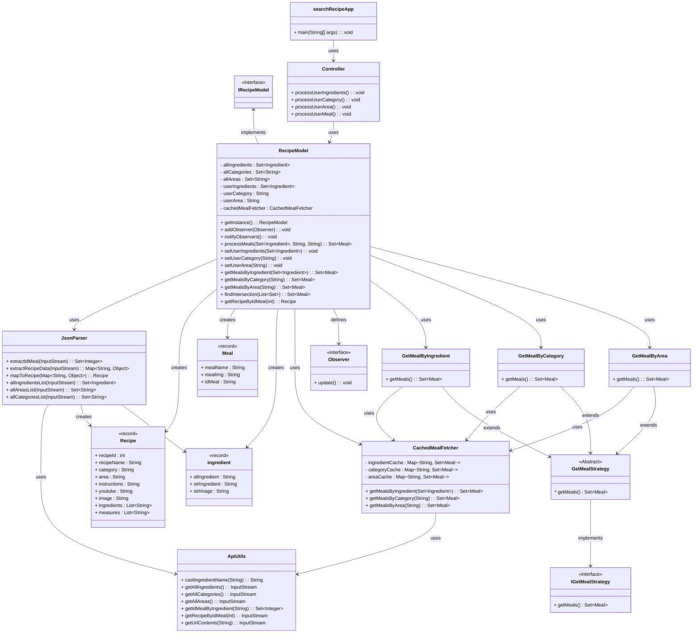

# Design Documents

You may have multiple design documents for this project. Place them all in this folder. File naming is up to you, but it should be clear what the document is about. At the bare minimum, you will want a pre/post UML diagram for the project. 

### Full project details - [Project Document (Google Doc)](https://docs.google.com/document/d/1VaDUGM-LZnDLe40iMbah4sar-XQG5n3iLFPSMUdu374/edit?usp=sharing)

## Initial UML

## Final UML

## Program Flow

### User Interaction:
- Display a comprehensive dropdown list of ingredients in alphabetical order.
- Allow users to select multiple ingredients from the list.

### Backend Processing:
- Fetch all available ingredients from TheMealDB API.
- For each selected ingredient, retrieve corresponding meal IDs.
- Obtain detailed recipes using the retrieved meal IDs.
- Aggregate and filter recipes based on user-selected ingredients.

### Output:
- Display matching recipes with images and brief descriptions.
- Provide detailed views with instructions, ingredient lists, and video tutorials.
- Offer an option to download selected recipes in JSON format.

## MVC
- **[package]** Model
- **[package]** api
    - **[class]** ApiUtils
- **[package]** formatter
    - **[class]** JsonParser
- **[package]** recipe
    - **[interface]** IRecipeModel (Polymorphism)
    - **[class]** RecipeModel
    - **[record class]** Recipe
    - **[record class]** Ingredient
    - **[record class]** Meal
    - **[interface]** Observer (Design pattern: Observer Pattern)
- **[package]** strategy (Design pattern: Strategy Pattern)
    - **[interface]** IGetMealStrategy (Inheritance)
    - **[abstract class]** GetMealStrategy
    - **[class]** GetMealByIngredient
    - **[class]** GetMealByCategory
    - **[class]** GetMealByArea
- **[package]** View
- **[package]** Controller
