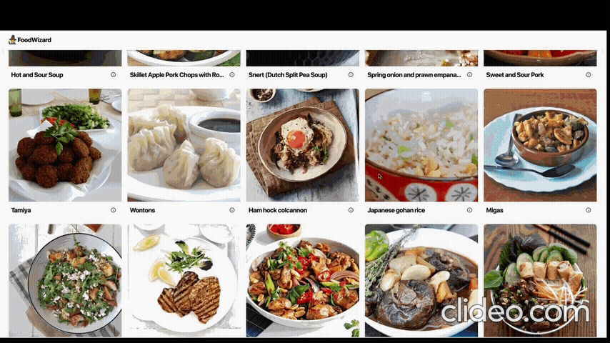
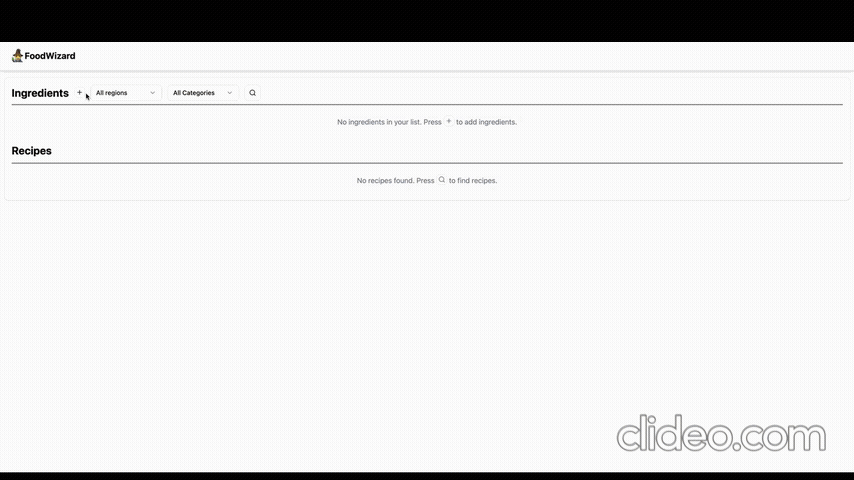

# Manual

Use this manual to guide you through the features of the application. You can also upload any relevant files or screenshots here to build a comprehensive application manual.

## Getting Started

- [ ] **Required:** Select at least one ingredient from the dropdown list.
  - Click the `+` button next to the **Ingredients** section.
  - You can also type in the ingredient name to search.
  - Watch the short instructional clip below:

    

  
- [ ] **Optional:** Filter your results by selecting up to one region and one category.

- [ ] Click the search button `🔍` to generate recipe recommendations.

- [ ] Browse the results in the **Recipes** section.

- [ ] Click the `ⓘ` button in the bottom-right corner of a recipe card to view more details.

- [ ] **Download Feature:** If you like a recipe and want to save it, click the download button next to the recipe title.
  - Here's a short video guide on how to download:

    

  
## Implemented Features

### Required Features

- [x] **View all items in the collection in a logical order**
  - Ingredients, regions, and categories are displayed in alphabetical order for easy navigation.

- [x] **Build a list of items from the collection**
  - After the user clicks the **Search** button, the selected ingredients are compiled, and a list of recommended recipes is displayed.

- [x] **Save the list using a supported file format (.xml, .json, or .csv)**
  - On the recipe detail page, users can download recipe details as a **JSON** file via the download button next to the recipe name.

### Additional Features

- [x] **Load and modify previously saved lists**
  - Implemented caching to remember the user's previous selections, allowing persistent and editable session history.

- [x] **Search for items in the collection**
  - Users can search for ingredients by typing in the name within the ingredient selection section.

- [x] **Filter items in the collection**
  - Users can filter by **category** and **region** to narrow down search results.

- [x] **Fetch item list from an online API**
  - Integrated data from **7 different APIs** to populate the application content dynamically.

- [x] **Include images for items**
  - Images are shown for both **ingredients** and **recipes**. Recipe detail pages also include **video tutorials**.

- [x] **Persist modifications across sessions**
  - User selections are cached to ensure a seamless experience across page reloads or revisits.
  

## 📽️ Video Walkthrough

