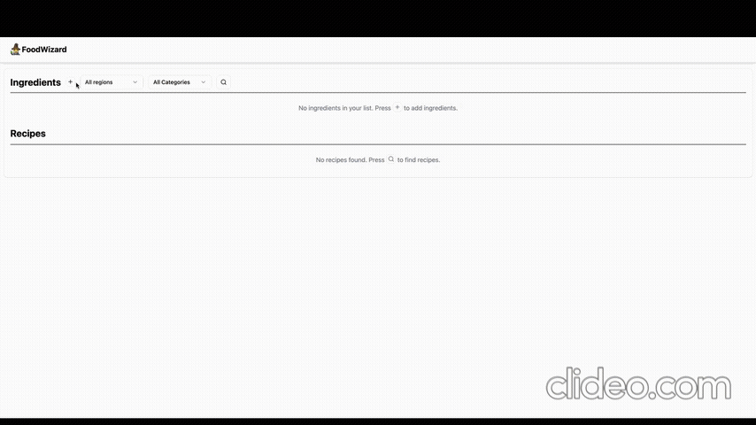

[](https://classroom.github.com/a/IE0ITl4j)
# Final Project for CS 5004 - Food Wizard 🧙‍♂️

## 🌐 Website
Access the live application here 👉 [**Food Wizard**](https://foodwizard.fly.dev/)

## 📖 Description
Food Wizard aims to assist users in discovering recipes based on the ingredients they have available. By selecting ingredients they possess, the system will suggest corresponding recipes, minimizing food waste and inspiring meal preparation.

## 📖 Background
Many individuals often find themselves with leftover ingredients and lack ideas on how to utilize them effectively. Food Wizard addresses this challenge by providing recipe suggestions tailored to the user's available ingredients, leveraging data from TheMealDB API.

## 📊 Database:
[TheMealDB API](https://www.themealdb.com/api.php)

## 👱🏼 Group Members:
- Lu-Yin Wang (Rebecca): [Personal GitHub](https://github.com/rebwang)
- Pei-Yu Chen (Lucy): [Personal GitHub](https://github.com/lucyyyychen) [(Also using "lucy-at-may4s" to contribute)](https://github.com/lucy-at-may4s)
- Chun-Wen Hsueh (Vince): [Personal GitHub](https://github.com/ChunWenHsueh)

## 📃 Project Doc:
- [Project Document (Google Doc)](https://docs.google.com/document/d/1VaDUGM-LZnDLe40iMbah4sar-XQG5n3iLFPSMUdu374/edit?usp=sharing)
- [Design Document](DesignDocuments/README.md)

# 🧰 Instructions

**For user manual, please refer to: [Manual](Manual/README.md)**

(Developer) How to run the program?
1. Clone the repository to your local machine.
2. Navigate to the project directory in your terminal.
3. Run the following command to run the app in your local machine:
    ```bash
    ./gradlew build # Linux/Mac
    gradlew.bat build # Window
    ```
4. The app should be running on your local machine. Open your web browser and go to `http://localhost:8080` to access the application.


## 📽️ Video Walkthrough

