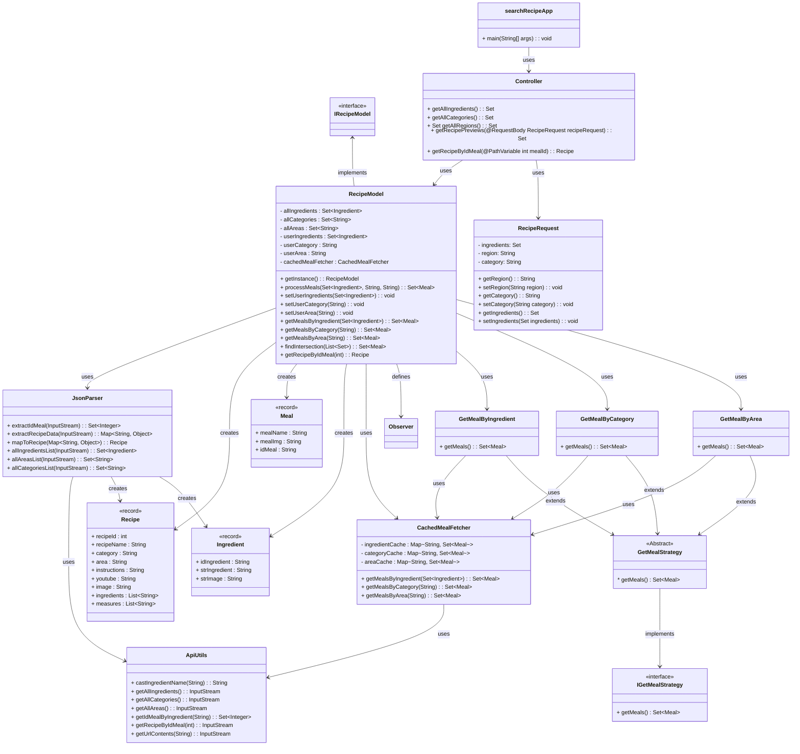

```mermaid
classDiagram

%% Dependencies
    JsonParser --> ApiUtils : uses
    JsonParser --> Recipe : creates
    JsonParser --> Ingredient : creates

    IRecipeModel <-- RecipeModel  : implements
    RecipeModel --> JsonParser : uses
    RecipeModel --> Recipe : creates
    RecipeModel --> Meal : creates
    RecipeModel --> Ingredient : creates
    RecipeModel --> CachedMealFetcher : uses

    RecipeModel --> Observer : defines
    CachedMealFetcher --> ApiUtils : uses
    RecipeModel --> GetMealByIngredient : uses
    RecipeModel --> GetMealByCategory : uses
    RecipeModel --> GetMealByArea : uses

    GetMealStrategy --> IGetMealStrategy : implements
    GetMealByIngredient --> CachedMealFetcher : uses
    GetMealByIngredient --> GetMealStrategy : extends
    GetMealByCategory --> CachedMealFetcher : uses
    GetMealByCategory --> GetMealStrategy : extends
    GetMealByArea --> CachedMealFetcher : uses
    GetMealByArea --> GetMealStrategy : extends

    searchRecipeApp --> Controller : uses
    Controller --> RecipeModel : uses
    Controller --> RecipeRequest : uses

%% Interfaces
    class IRecipeModel {
        <<interface>>
    }

    class IGetMealStrategy {
        <<interface>>
        + getMeals() Set~Meal~
    }


%% Abstract class
    class GetMealStrategy {
        <<Abstract>>
        * getMeals() Set~Meal~
    }

%% Core classes
    class ApiUtils {
        + castIngredientName(String) : String
        + getAllIngredients() : InputStream
        + getAllCategories() : InputStream
        + getAllAreas() : InputStream
        + getIdMealByIngredient(String) : Set~Integer~
        + getRecipeByIdMeal(int) : InputStream
        + getUrlContents(String) : InputStream
    }

    class JsonParser {
        + extractIdMeal(InputStream) : Set~Integer~
        + extractRecipeData(InputStream) : Map~String, Object~
        + mapToRecipe(Map~String, Object~) : Recipe
        + allIngredientsList(InputStream) : Set~Ingredient~
        + allAreasList(InputStream) : Set~String~
        + allCategoriesList(InputStream) : Set~String~
    }

    class Ingredient {
        <<record>>
        + idIngredient : String
        + strIngredient : String
        + strImage : String
    }

    class Meal {
        <<record>>
        + mealName : String
        + mealImg : String
        + idMeal : String
    }

    class Recipe {
        <<record>>
        + recipeId : int
        + recipeName : String
        + category : String
        + area : String
        + instructions : String
        + youtube : String
        + image : String
        + ingredients : List~String~
        + measures : List~String~
    }

    class RecipeModel {
        - allIngredients : Set~Ingredient~
        - allCategories : Set~String~
        - allAreas : Set~String~
        - userIngredients : Set~Ingredient~
        - userCategory : String
        - userArea : String
        - cachedMealFetcher : CachedMealFetcher
        + getInstance() : RecipeModel
        + processMeals(Set~Ingredient~, String, String) : Set~Meal~
        + setUserIngredients(Set~Ingredient~) : void
        + setUserCategory(String) : void
        + setUserArea(String) : void
        + getMealsByIngredient(Set~Ingredient~) : Set~Meal~
        + getMealsByCategory(String) : Set~Meal~
        + getMealsByArea(String) : Set~Meal~
        + findIntersection(List~Set~<Meal~>) : Set~Meal~
        + getRecipeByIdMeal(int) : Recipe
    }

    class CachedMealFetcher {
        - ingredientCache : Map~String, Set~Meal~~
        - categoryCache : Map~String, Set~Meal~~
        - areaCache : Map~String, Set~Meal~~

        + getMealsByIngredient(Set~Ingredient~) : Set~Meal~
        + getMealsByCategory(String) : Set~Meal~
        + getMealsByArea(String) : Set~Meal~
    }

    class Controller {
        + getAllIngredients(): Set<Ingredient>
        + getAllCategories(): Set<String>
        + Set<String> getAllRegions(): Set<String>
        + getRecipePreviews(@RequestBody RecipeRequest recipeRequest): Set<Meal>
        + getRecipeByIdMeal(@PathVariable int mealId): Recipe
    }

    class searchRecipeApp {
        + main(String[] args) : void
    }

    class GetMealByIngredient {
        + getMeals() : Set~Meal~
    }

    class GetMealByCategory {
        + getMeals() : Set~Meal~
    }

    class GetMealByArea {
        + getMeals() : Set~Meal~
    }

    class RecipeRequest {
        - ingredients: Set<Ingredient>
        - region: String
        - category: String
        + getRegion(): String
        + setRegion(String region): void
        + getCategory(): String
        + setCategory(String category): void
        + getIngredients(): Set<Ingredient>
        + setIngredients(Set<Ingredient> ingredients): void
    }


```