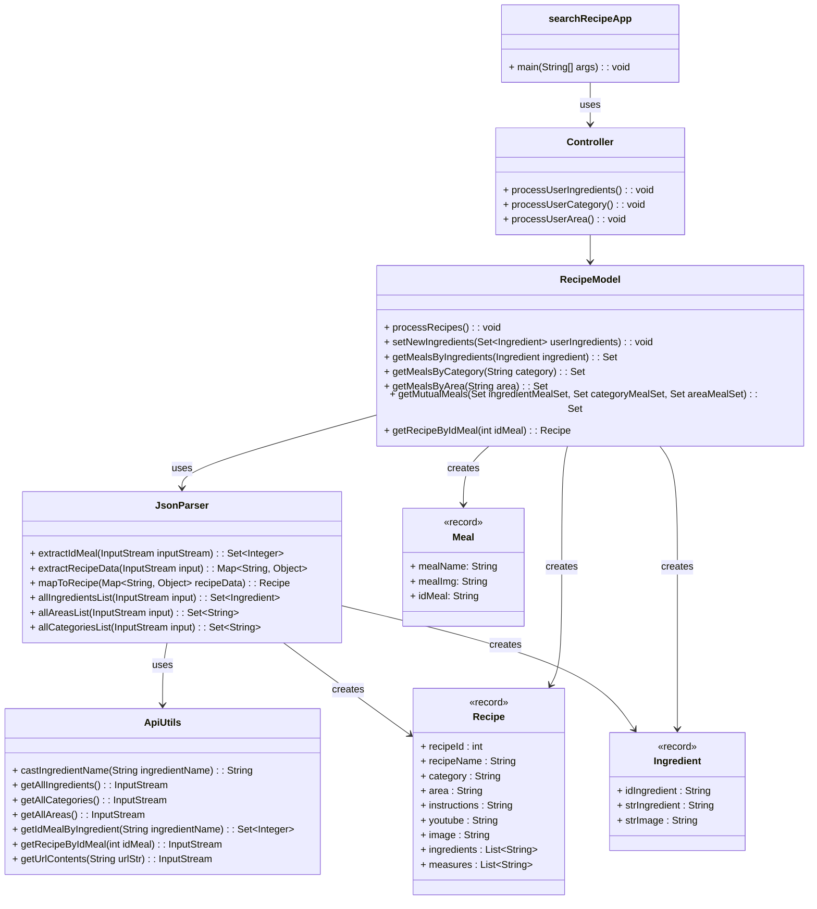

```mermaid
classDiagram


    JsonParser --> ApiUtils : uses
    JsonParser --> Recipe : creates
    JsonParser --> Ingredient : creates
    
    RecipeModel --> JsonParser: uses
    RecipeModel --> Recipe: creates
    RecipeModel --> Meal: creates
    RecipeModel --> Ingredient: creates
    searchRecipeApp --> Controller: uses
    Controller --> RecipeModel

    
    class ApiUtils {
        + castIngredientName(String ingredientName) : String
        + getAllIngredients() : InputStream
        + getAllCategories() : InputStream
        + getAllAreas() : InputStream
        + getIdMealByIngredient(String ingredientName) : Set~Integer~
        + getRecipeByIdMeal(int idMeal) : InputStream
        + getUrlContents(String urlStr) : InputStream
    }
    
    class JsonParser {
        + extractIdMeal(InputStream inputStream) : Set~Integer~
        + extractRecipeData(InputStream input) : Map~String, Object~
        + mapToRecipe(Map~String, Object~ recipeData) : Recipe
        + allIngredientsList(InputStream input) : Set~Ingredient~
        + allAreasList(InputStream input) : Set~String~
        + allCategoriesList(InputStream input) : Set~String~
    }
    
    class Ingredient {
        <<record>>
        + idIngredient : String
        + strIngredient : String
        + strImage : String
    }

    class Meal {
        <<record>>
        + mealName: String
        + mealImg: String
        + idMeal: String
    }

    class Recipe {
        <<record>>
        + recipeId : int
        + recipeName : String
        + category : String
        + area : String
        + instructions : String
        + youtube : String
        + image : String
        + ingredients : List~String~
        + measures : List~String~
    }
    
    class RecipeModel {
        + processRecipes() : void
        + setNewIngredients(Set~Ingredient~ userIngredients) : void
        + getMealsByIngredients(Ingredient ingredient): Set<Meal>
        + getMealsByCategory(String category): Set<Meal>
        + getMealsByArea(String area): Set<Meal>
        + getMutualMeals(Set<Meal> ingredientMealSet, Set<Meal> categoryMealSet, Set<Meal> areaMealSet): Set<Meal>
        
        + getRecipeByIdMeal(int idMeal) : Recipe
        
    }
    
    class Controller {
        + processUserIngredients(): void
        + processUserCategory(): void
        + processUserArea(): void
    }
    
    
    class searchRecipeApp {
        + main(String[] args): void
    }
```